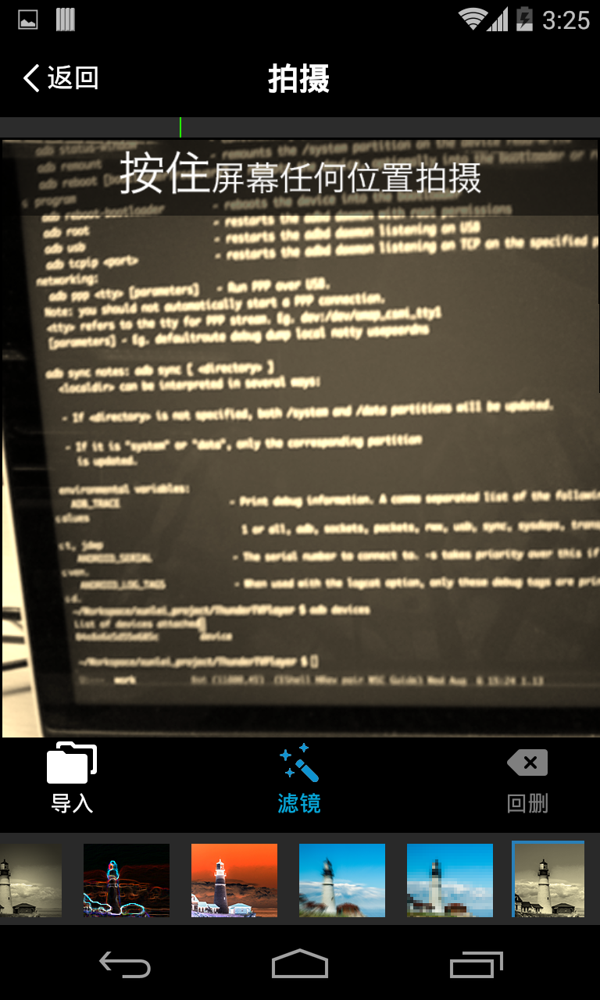

VCamera
===============

VCamera SDK Android版（短视频拍摄SDK）是炫一下（北京）科技有限公司官方推出的Android平台使用的软件开发工具包，为Android开发者提供简单、快捷的接口，帮助开发者实现Android平台上的短视频应用开发。

工程取自: https://www.vitamio.org/docs/Tutorial/2014/0731/35.html
放在github上仅为了方便访问

特性
------------

# 支持分段拍摄、回删
# 支持静态/动态水印、声音主题合成
# 支持FFmpeg命令行
# 支持ARMV7 CPU

如何使用
----------

请参考VCamera Android SDK用户手册_v1.x.pdf

授权
-------

个人免费，企业收费（商务sales@yixia.com，电话座机010-6482 8682）

Demo Screenshot:

